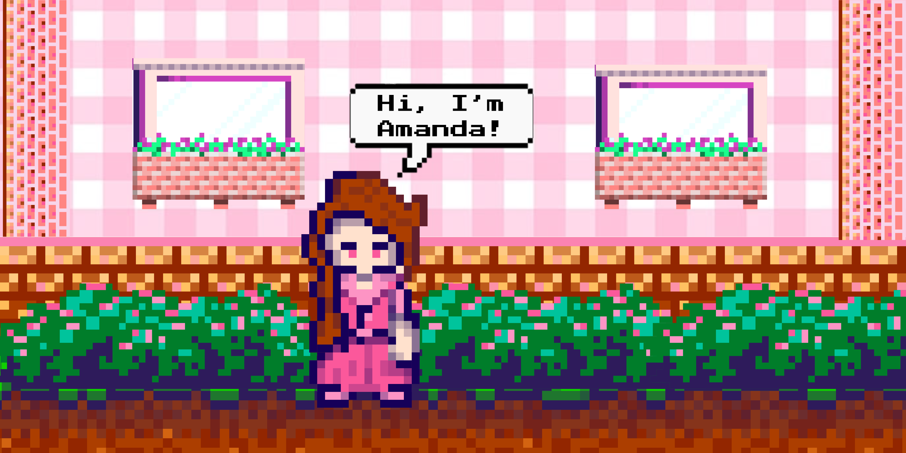

# 👋 Hi there, I'm Amanda Caroline Young!

I'm a **Computer Science student** with a growing focus on **Data Analytics** and **Web Development** — turning raw data and ideas into clean, usable, and meaningful digital experiences.

I enjoy working at the intersection of **logic, design, and storytelling**, whether that’s through dashboards, web apps, or data-driven insights.

---

## 🌿 About Me
- 📊 Interested in **Data Analytics**, **Data Visualization**, and **Data-driven decision making**
- 💻 Passionate about **front-end web development** and building clean, responsive interfaces
- 📈 Exploring **Python for data analysis**, **SQL**, and real-world datasets
- 🎨 I care about making things that are not just functional, but *pleasant to use*
- 📚 Currently strengthening my foundations in **Python**, **Pandas**, **SQL**, **HTML**, **CSS**, and **JavaScript**

---

## 💻 Tech Stack

### 🧮 Data Analytics

### 🌐 Web Development & Design

---

## 🚀 Projects

### 📊 ChurnChaser
An **interactive data analytics dashboard** built to analyze customer churn patterns and uncover actionable insights using visualizations and data exploration.  
**Built with:** Python, Pandas, Streamlit, Data Visualization

---

### 🌸 LilyLane
A boutique-style **e-commerce website** created as a college project with a focus on elegant UI, responsive layouts, and smooth navigation.  
**Built with:** HTML, CSS, JavaScript

---

### 📚 BookVista
A user-friendly **online bookstore platform** that allows browsing, searching, adding/removing books, and curating a personalized bookshelf.  
**Built with:** HTML, CSS, JavaScript

---

### 🌈 WasWeather
A clean and functional **weather web app** that fetches real-time weather data using the [WeatherAPI](https://www.weatherapi.com/).  
Users can search for any city and view live temperature, humidity, and forecast details.  
**Built with:** HTML, CSS, JavaScript, WeatherAPI

---

## 💬 Soft Skills
- Clear communication & empathy  
- Analytical thinking  
- Creative problem-solving  
- Comfortable working independently and in team-based environments  

---

## 🧩 Fun Facts
- 🎮 When I’m not coding, I’m building story-driven Minecraft worlds with lore, scrolls, and secret chambers
- 🧠 I love organizing ideas, projects, and thoughts into structured lists

---

## 📫 Let's Connect!
I'm always open to internships, collaborations, learning opportunities, and tech conversations ✨

- 🔗 [LinkedIn](https://www.linkedin.com/in/amanda-caroline-young-168141266)

*Thanks for visiting my corner of the internet — where data meets design, and code turns ideas into insight 📊🌿*
